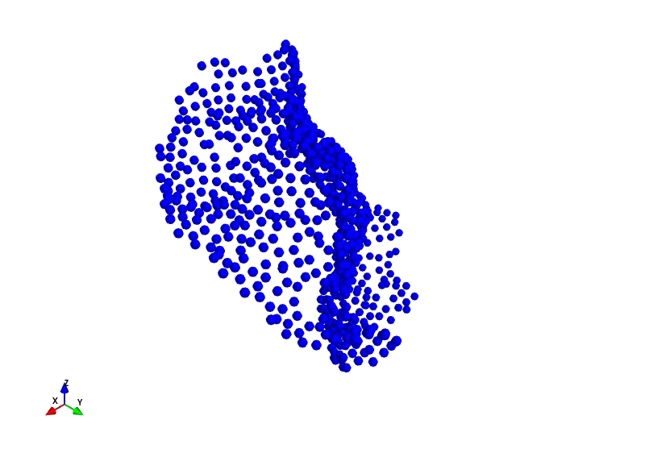
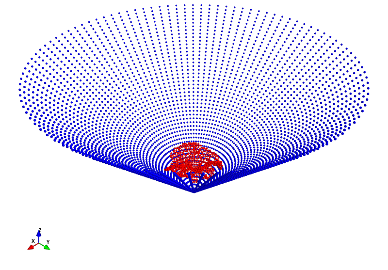
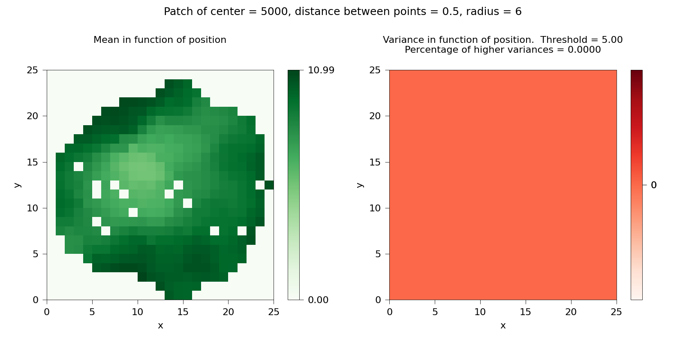
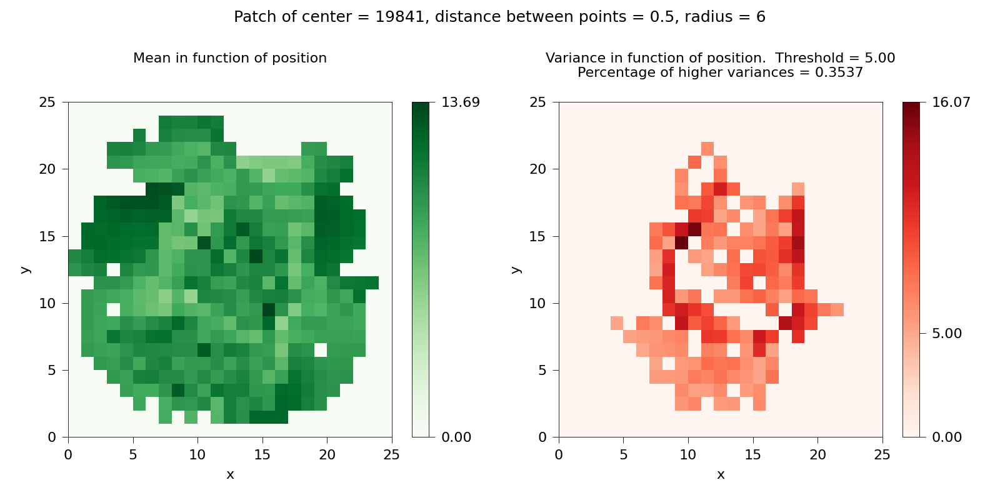
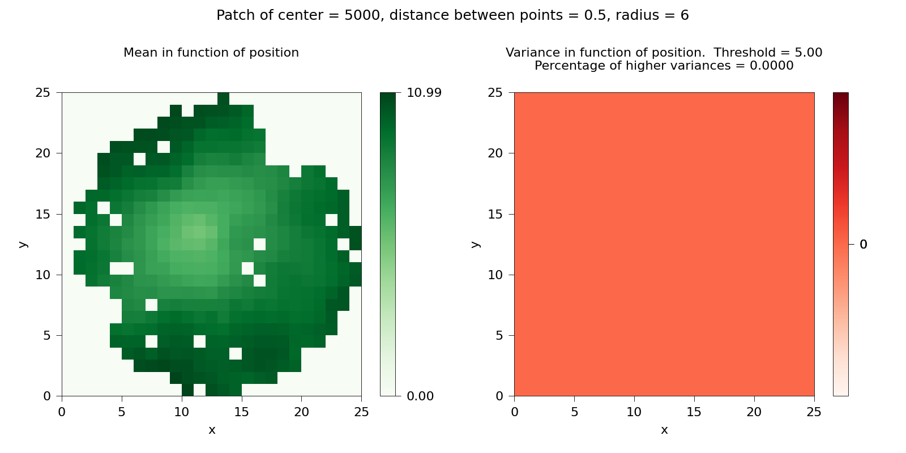
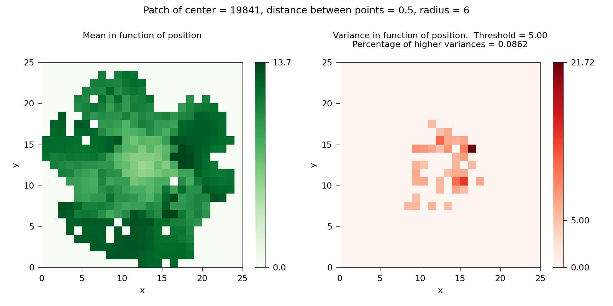

**Autori**: Alessandro Giudice, Samuel Santhosh Gomez  

# Percentuale di non funzionalità di una patch
Di seguito riporto la procedura per calcolare la percentuale di non funzionalità di una specifica zona di una superficie proteica in 3D.  
Il `testo` scritto in questa maniera rappresenta le variabili del codice usato, visibile in appendice.   

## Selezione di una patch
Una patch, come quella in Figura 1, è un gruppo di punti di una superficie 3D.
<p align="center"></p>
<p align="center"><i>Figura 1</i>: Una possibile patch della superficie.</p>

Tali punti sono selezionati come punti della patch se essi hanno una distanza reciproca non superiore al valore soglia `Dpp`, e se sono contenuti in una sfera avente come centro l'indice di un punto dell'intera superficie `center` e un raggio `Rs`.  
Poi la patch selezionata deve essere inglobata in un cono come in Figura 2.
<p align="center"></p>
<p align="center"><i>Figura 2</i>: Patch (rosso) all'interno del cono (blu).</p>

Tale cono è posto lungo l'asse z, con origine nel punto C=(0,0,`z`), in modo che l'angolo massimo tra l'asse perpendicolare e la secante che connette C a un punto della superficie (o della patch) sia uguale a `theta_max = 45`.  

Come anticipato sopra, un piano di fit per sarà rappresentato da una matrice quadrata 2D di lato `Npixel`. Le matrici, cioè i piani di fit, producibili sono due:

* la matrice in cui in ogni elemento è la media delle distanze contenute nel relativo pixel.

* la matrice in cui in ogni elemento è la varianza delle distanze contenute nel relativo pixel.

## Creazione del piano di fit
Ogni punto della patch viene proiettato su una griglia quadrata 2D di lato `Npixel`, in cui ogni cella è un pixel. All'interno di ogni pixel ci possono essere il valore della media o della varianza delle distanze tra i relativi punti della patch e l'origine C del cono. Di conseguenza i possibili piani da creare sono due:

* la matrice delle medie delle distanze in ogni pixel, come nella parte sinistra delle Figure 3-4.

* la matrice delle varianze delle distanze in ogni pixel, come nella parte destra delle Figure 3-4.

Le distanze utilizzate per ogni matrice nelle Figure 3-4 sono solo quelle contenute in un disco unitario (distanze minori o uguali a uno).  
Per creare il piano della media e della varianza di tali distanze ci sono due metodi.  
Il primo metodo costruisce un piano in cui ogni pixel raccoglie le distanze rispetto ai punti della patch posti perpendicolarmente sopra un pixel. Il valore finale in ogni pixel sarà la media o la varianza di tali distanze. Esempi di tale metodo sono visibili in Figura 3.
<p align="center">


</p>
<p align="center"><i>Figura 3</i>: Media e varianza di due patch (la prima nella riga sopra, l'altra sotto) prodotte con il primo metodo.</p>
Invece nel secondo metodo il piano viene costruito in modo che ogni pixel raccolca le distanze rispetto ai punti della patch se il segmento che congiunge un punto della patch e il punto C intercetta tale pixel. Il valore finale in ogni pixel sarà di nuovo la media o la varianza di tali distanze. Esempi di tale metodo sono visibili in Figura 4.
<p align="center">


</p>
<p align="center"><i>Figura 4</i>: Media e varianza di due patch (la prima nella riga sopra, l'altra sotto) prodotte con il secondo metodo.</p>

## Percentuale di non funzionalità
La percentuale di non funzionalità di una patch coincide con la percentuale di pixel della matrice che contengono una varianza superiore ad una soglia `threshold`. Il valore di tale soglia è indicato sulla barra colorata del grafico a destra delle Figure 3-4. Per ogni pixel, se la varianza è inferiore a tale soglia verrà mostrato un colore uniforme (grafico in alto in Figura 3-4), in caso contrario verrà visualizzato un colore più o meno scuro per un valore alto o basso della varianza (grafico in basso in Figura 3-4).

## Appendice
### Librerie
Il codice scritto è stato eseguito con <a href="https://jupyterlab.readthedocs.io/en/stable/" target="_blank">JupyterLab</a> utilizzando almeno `python 3.8.10`.  
I moduli python usati, compreso `jupyterlab`, che sono stati installati tramite 
<a href="https://pip.pypa.io/en/stable/" target="_blank">pip</a>, sono elencati sotto.
```python
import os, sys
import numpy as np
import matplotlib.pyplot as mpl
import scipy as sp
import pandas as pd
```
```python
from mayavi import mlab
```
in particolare `mlab` è necessario per visualizzare le superfici 3D tramite una finestra Qt, così da produrre le Figure 1-2.     
Mentre le librerie di base sono
```python
sys.path.append("./bin/")
import ZernikeFunc as ZF
import SurfaceFunc as SF
```
scritte da <a href="https://scholar.google.it/citations?user=hjkTN0YAAAAJ&hl=it" target="_blank">Mattia Miotto</a>.

### Parametri
I valori dei parametri usati per selezionare e fittare una patch sono
```python
Npixel = 25    # il lato del piano in pixel
Dpp = 0.5      # la distanza tra i punti della stessa patch
Rs = 6         # il raggio della sfera che include la patch
threshold = 5  # valore soglia per stabilire se la varianza è alta (in ångström)
```
L'indice del punto centrale della patch usato per Figura 1, Figura 2, e per i grafici nella parte alta della Figura 3-4 è
```python
center = 5000
```
invece quello usato per i grafici nella parte bassa della Figura 3-4 è
```python
center = 19841
```
### Caricare una superficie proteica
Una volta scelta la proteina da studiare bisogna scaricare il relativo file *.pdb* dalla
<a href="https://www.rcsb.org/" target="_blank">Protein Data Bank</a>
da cui creare un file *.dms* (per esempio con il tool
<a href="https://www.cgl.ucsf.edu/chimera/docs/UsersGuide/midas/dms1.html" target="_blank">dms</a>
), contenente una serie di dati su atomi e punti della superficie.
```python
surf_name_a = "./data/4bs2_RRM2.dms"
surf_a_ = pd.read_csv(surf_name_a)  
l_a = len(surf_a_["x"])
print("Npoints", l_a)
surf_a = np.zeros((l_a, 6))
surf_a[:,:] = surf_a_[["x", "y", "z", "Nx", "Ny", "Nz"]]
```
dove `surf_name_a` è il percorso del file *.dms*, visibile <a href="data/4bs2_RRM2.dms" target="_blank">qui</a>.  
La matrice relativa all'intera superficie `surf_a` deve essere inizializzato come oggetto della classe `Surface`: 
```python
surf_a_obj = SF.Surface(surf_a[:,:], patch_num = 0, r0 = Rs, theta_max = 45)
```
### Selezione di una patch
Dopo aver caricato la superficie completa, una patch è costruita in base ai parametri scelti tramite
```python
patch, _ = surf_a_obj.BuildPatch(point_pos=center, Dmin=Dpp)
```
Per produrre il grafico in Figura 1, con `center = 5000`, si usa:
```python
res1, c = SF.ConcatenateFigPlots([patch[:,:3]])
SF.Plot3DPoints(res1[:,0], res1[:,1], res1[:,2], c, 0.3)
```
Per essere utilizzabile, la patch deve essere ruotata (`patch` diventa `rot_patch`) in modo che sia perpendicolare al piano $xy$. Questo si può fare con
```python 
rot_patch, rot_patch_nv = surf_a_obj.PatchReorientNew(patch, +1)
```
dove il parametro `+1` indica che i versori normali `rot_patch_nv` sono rivolti verso l'alto.  
Per trovare la quota `z` dell'origine $C$ del cono che ingloba la patch si usa
```python
z = surf_a_obj.FindOrigin(rot_patch, 0)
```
dove se si sostituisce `0` con `1` si produce il grafico dellapatch inglobata dentro il cono. La Figura 2 si ottiene con `center = 5000`.

### Creazione del piano di fit
Per creare il piano della media e delle varianza con il primo metodo si utilizza la funzione
```python
def CreatePlane_Weigths(label, patch, z_c, Np = 20) :

    rot_p = np.copy(patch)

    # shifting patch to have the cone origin in [0,0,0]
    rot_p[:,2] -= z_c

    # computing distances between points and the origin
    weigths = np.sqrt(rot_p[:,0]**2 + rot_p[:,1]**2 + rot_p[:,2]**2)
    
    # computing angles on plane
    thetas = np.arctan2(rot_p[:,1], rot_p[:,0])

    # computing distances in plane
    dist_plane = np.sqrt(rot_p[:,0]**2 + rot_p[:,1]**2)

    # computing the circle radius as the maximum distant point
    R = np.amax(dist_plane)*1.01

    # creating plane matrix
    if label == "mean" :
        plane = np.zeros((Np,Np))
    elif label == "var" :
        plane_var = np.zeros((Np,Np))
    else :
        plane = np.zeros((Np,Np))
        plane_var = np.zeros((Np,Np))
    
    # adapting points to pixels
    rot_p[:,0] += R
    rot_p[:,1] -= R

    pos_plane = rot_p[:,:2]
    
    # taking values only within unit disk

    dR = 2.*R/Np
    rr_x = 0
    rr_y = 0
    for i in range(Np):
        rr_y = 0
        for j in range(Np):
            mask_x = np.logical_and(pos_plane[:,0]> rr_x, pos_plane[:,0]<= rr_x+dR)
            mask_y = np.logical_and(pos_plane[:,1]< -rr_y, pos_plane[:,1]>= -(rr_y+dR))
            mask = np.logical_and(mask_x, mask_y)
            if(len(weigths[mask]) > 0):
                if label == "mean" :
                    plane[j,i] = np.mean(weigths[mask])
                elif label == "var" :
                    plane_var[j,i] = np.var(weigths[mask])
                else :
                    plane[j,i] = np.mean(weigths[mask])
                    plane_var[j,i] = np.var(weigths[mask]) 
            rr_y += dR
        rr_x += dR
        
    if label == "mean" :
        return plane, weigths, dist_plane, thetas
    elif label == "var" :
        return plane_var, weigths, dist_plane, thetas
    else :
        return plane, plane_var, weigths, dist_plane, thetas
```
Invece con il secondo metodo si usa la funzione
```python
 def CreatePlane_Projections(label, patch, z_c, Np = 20) :
    
    rot_p = np.copy(patch)
     
    # computing distances between points and the origin of cone in [0,0,z_c]
    weigths = np.sqrt(rot_p[:,0]**2 + rot_p[:,1]**2 + (rot_p[:,2]-z_c)**2)
    
    # angles of slope, respect to the fit plane, of segments that connect a surface point and the origin of cone
    slope_angle = np.arcsin( (rot_p[:,2]-z_c) / weigths[:] )
    
    # shift from original xy coordinates to intersection coordinates of segments with fit plane
    # shift values are positive if rot_p[:,2] > 0 or negative if rot_p[:,2] < 0  
    shift = (rot_p[:,2]) / np.tan(slope_angle)
    
    # computing distances in plane
    dist_plane = np.sqrt(rot_p[:,0]**2 + rot_p[:,1]**2) + shift
    
    # computing the circle radius as the maximum distant point
    R = np.amax(dist_plane)*1.01
    
    # computing angles on plane (slope of shift segments on fit plane)
    thetas = np.arctan2(rot_p[:,1], rot_p[:,0])
    
    # new coordinates of points on fit plane
    rot_p[:,0] += shift[:]*np.cos(thetas[:])
    rot_p[:,1] += shift[:]*np.sin(thetas[:])

    # creating plane matrix
    if label == "mean" :
        plane = np.zeros((Np,Np))
    elif label == "var" :
        plane_var = np.zeros((Np,Np))
    else :
        plane = np.zeros((Np,Np))
        plane_var = np.zeros((Np,Np))
    
    # adapting points to pixels
    rot_p[:,0] += R
    rot_p[:,1] -= R

    pos_plane = rot_p[:,:2]
    
    # taking values only within unit disk

    dR = 2.*R/Np
    rr_x = 0
    rr_y = 0
    for i in range(Np):
        rr_y = 0
        for j in range(Np):
            mask_x = np.logical_and(pos_plane[:,0]> rr_x, pos_plane[:,0]<= rr_x+dR)
            mask_y = np.logical_and(pos_plane[:,1]< -rr_y, pos_plane[:,1]>= -(rr_y+dR))
            mask = np.logical_and(mask_x, mask_y)
            if(len(weigths[mask]) > 0):
                if label == "mean" :
                    plane[j,i] = np.mean(weigths[mask])
                elif label == "var" :
                    plane_var[j,i] = np.var(weigths[mask])
                else :
                    plane[j,i] = np.mean(weigths[mask])
                    plane_var[j,i] = np.var(weigths[mask]) 
            rr_y += dR
        rr_x += dR
        
    if label == "mean" :
        return plane, weigths, dist_plane, thetas
    elif label == "var" :
        return plane_var, weigths, dist_plane, thetas
    else :
        return plane, plane_var, weigths, dist_plane, thetas
```
### Percentuale di non funzionalità
Per calcolare la percentuale di varianze più alte di una certa soglia con il primo metodo si usa
```python
def PercHigherVariance_Weigths(label, Npixel, surf_a_obj, center, Dpp, threshold) :
    
    patch, mask = surf_a_obj.BuildPatch(point_pos=center, Dmin=Dpp)
    rot_patch, _ = surf_a_obj.PatchReorientNew(patch, 1)
    
    ## To project the patch on the xy plane...
    z = surf_a_obj.FindOrigin(rot_patch)
    
    # Per ottenere il piano delle varianze (rispettivamente senza o con il piano delle medie)
    if label == "var" :
        plane_var, _, _, _ = CreatePlane_Weigths("var", patch=rot_patch, z_c=z , Np=Npixel)
    else :
        plane, plane_var, _, _, _ = CreatePlane_Weigths("", patch=rot_patch, z_c=z , Np=Npixel)
    
    # Inizializzo la classe Zernike2d
    ZernikeM = ZF.Zernike2d(plane_var)
    
    # Cambiamento di base della matrice nella base polare
    plane_var_polar = ZernikeM.r
    
    # Individuo quali distanze sono all'interno del disco unitario (cioè sono minori o uguali a 1) tramite una maschera
    polar_mask = (plane_var_polar <= 1)
    
    # Valori delle varianze nel disco unitario
    plane_var_masked = plane_var[polar_mask]
    
    # Numero di pixel all'interno del cerchio unitario
    Npixel_new = len(plane_var_masked)
    
    # Numero di varianze non nulle sopra la soglia (threshold) usando una maschera
    num_high_var = np.count_nonzero( plane_var_masked > threshold )
    
    perc = num_high_var / Npixel_new 
    
    if label == "var" :
        return plane_var, perc
    else :
        return plane, plane_var, perc
```
 Invece con il secondo metodo si usa la funzione
```python
def PercHigherVariance_Projections(label, Npixel, surf_a_obj, center, Dpp, threshold) :
    
    patch, mask = surf_a_obj.BuildPatch(point_pos=center, Dmin=Dpp)
    rot_patch, _ = surf_a_obj.PatchReorientNew(patch, 1)
    
    ## To project the patch on the xy plane...
    z = surf_a_obj.FindOrigin(rot_patch)
    
     # Per ottenere il piano delle varianze (rispettivamente senza o con il piano delle medie)
    if label == "var" :
        plane_var, _, _, _ = CreatePlane_Projections("var", patch=rot_patch, z_c=z , Np=Npixel)
    else :
        plane, plane_var, _, _, _ = CreatePlane_Projections("", patch=rot_patch, z_c=z , Np=Npixel)
    
    # Inizializzo la classe Zernike2d
    ZernikeM = ZF.Zernike2d(plane_var)
    
    # Cambiamento di base della matrice nella base polare
    plane_var_polar = ZernikeM.r
    
    # Individuo quali distanze sono all'interno del disco unitario (cioè sono minori o uguali a 1) tramite una maschera
    polar_mask = (plane_var_polar <= 1)
    
    # Valori delle varianze nel disco unitario
    plane_var_masked = plane_var[polar_mask]
    
    # Numero di pixel all'interno del cerchio unitario
    Npixel_new = len(plane_var_masked)
    
    # Numero di varianze non nulle sopra la soglia (threshold) usando una maschera
    num_high_var = np.count_nonzero( plane_var_masked > threshold )
    
    perc = num_high_var / Npixel_new 
    
    if label == "var" :
        return plane_var, perc
    else :
        return plane, plane_var, perc
```
### Grafici
```python
def MatrixMasked(matrix, mask) :
    matrix_new = np.where(mask, matrix, 0)
    return matrix_new
```
```python
def PlotMeanVariancePatch(center, Dpp, Rs, perc, T, pm, pv, color_maps, name) :
    
    mx1 = pm
    mx2 = MatrixMasked(pv, (pv >= T))
    matrix = [ mx1, mx2 ]
    
    s0 = "Patch of center = {}, distance between points = {}, radius = {}".format(center, Dpp, Rs)
    
    s1 = "Mean in function of position\n\n"
    if T == 0 :
        s2 = "Variance in function of position\n\n"
    else :
        s2 = "Variance in function of position.  Threshold = {:.2f}\nPercentage of higher variances = {:.4f}\n".format(T, perc)
        
    titles = [s1, s2]
    
    if len(color_maps) != 2 :
        color_maps = ["Greens", "Reds"]

    fig, ax = mpl.subplots(nrows=1, ncols=2, figsize=(8,4), facecolor="white", dpi=200) # dpi=200 per compensare rasterized
    fig.suptitle(s0, fontsize="9")

    for row in range(1) :
        for col in range(2):
            data = matrix[col]
            min_data = np.amin(data)
            max_data = np.amax(data)
            ax[col].set_title(titles[col], fontsize="8")
            ax[col].set_xlabel("x", fontsize="8")
            ax[col].set_ylabel("y", fontsize="8")
            ax[col].tick_params(axis="both", width ="0.30", color="black", labelsize="8")
            for side in ax[col].spines.keys():  # 'top', 'bottom', 'left', 'right'
                ax[col].spines[side].set_linewidth(0.30)
                ax[col].spines[side].set_color("black")
            im = ax[col].pcolormesh(data, cmap=color_maps[col], rasterized=True) # senza rasterized il file è troppo grande
            if col == 1 :
                ticks_list = [min_data, T, max_data]
            else :
                ticks_list = [min_data, max_data]
            cb = mpl.colorbar(im, ax=ax[col], ticks=ticks_list)
            cb.ax.tick_params(axis="both", width ="0.30", color="black", labelsize="8")
            for side in cb.ax.spines.keys():  # 'top', 'bottom', 'left', 'right'
                cb.ax.spines[side].set_linewidth(0.30)
                cb.ax.spines[side].set_color("black")

    fig.tight_layout()
    
    if name != "" or name == "default" :
        if name == "default" :
            n = "MeanVariance_Patch{}_Dpp{}_perc{}".format(center, Dpp, perc)
        else :
            n = name
        mpl.savefig("{}.pdf".format(n))
        print("The figure was generated.")
```
